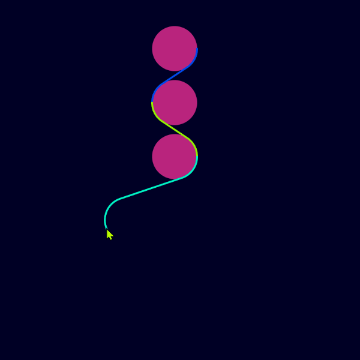

[](https://jitpack.io/#micycle1/Dubins-Curves)


# Dubins-Curves

This software finds the shortest paths between configurations for the Dubins' car, the forward-only car-like vehicle with a constrained turning radius.

This a Java port of the [original C++](https://github.com/AndrewWalker/Dubins-Curves) code by Andrew Walker.

## Background
* A Dubins path is the shortest curve that connects two points in the 2D plane, with a constraint on the curvature of the path and with prescribed initial and terminal tangents to the path (or heading angles).
* Dubins paths consist of 3 adjoined segments, that can be either left-curving, right-curving or straight. There are only 6 combinations of these segments that describe all possible Dubins paths.
* Dubins paths are commonly used in the fields of robotics and control theory as a way to plan paths for wheeled robots, airplanes and underwater vehicles.
## Usage

### Maven/Gradle
This repository is hosted as a Maven/Gradle artifact via [Jitpack](https://jitpack.io/#micycle1/Dubins-Curves).

### Example

The following code snippet demonstrates how to generate intermediate points along the shortest path between a pair of configuration (x, y, theta).

```
import java.util.Arrays;
import micycle.dubinscurves.DubinsPath;

public class DubinsDemo {
	
	public static void main(String[] args) {
		
		double q0[] = { 0, 0, 0 }; // initial configuration
		double q1[] = { 4, 4, Math.PI }; // terminating configuration
		double turning_radius = 1.0;
		double sample_step_size = 0.1;

		DubinsPath path = new DubinsPath(q0, q1, turning_radius);
		path.sampleMany(sample_step_size, (double[] q, double t) -> {
		    System.out.println("q = " + Arrays.toString(q) + ", length = " + t);
		    return 0; // continue sampling
		});
	}

}
```

## Illustrations

<p float="middle">
  <a href="examples/textOffsetCurves"></a>
  <a href="examples/partitionSmooth"></a>
</p>